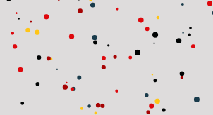

# js-canvas-bubbles

This is an awesome html canvas tutorial by Chris Curses's [video tutorial](https://www.youtube.com/watch?v=EO6OkltgudE).

This repository now contains the TypeScript version of the tutorial - please, note that the TS version is my own work, and I am not a TS expert..

